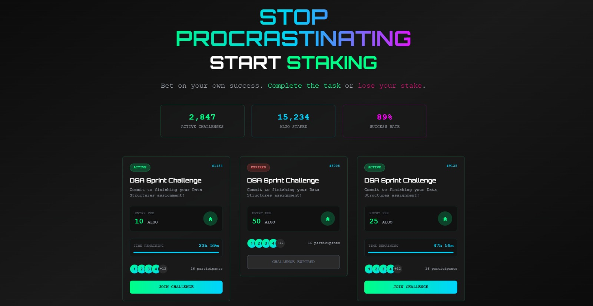
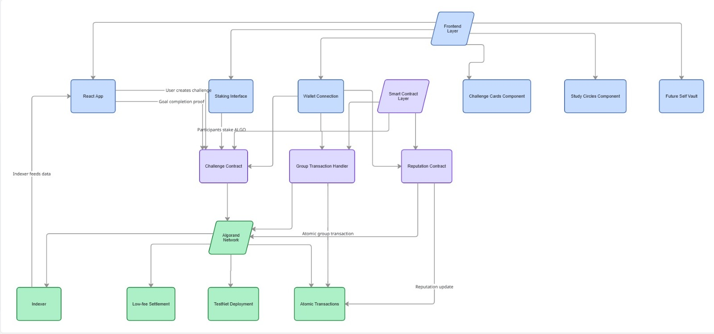

# Commit-Fi: Accountability Staking on Algorand

**Transform procrastination into productivity through blockchain-powered commitment contracts**

---

## Problem Statement

Students and professionals struggle with accountability. Traditional goal-setting lacks financial consequences, leading to broken commitments and wasted potential. Existing solutions lack real stakes and trustless enforcement.

## Solution Overview

Commit-Fi is a decentralized accountability platform where users stake ALGO on personal and collaborative goals. Smart contracts automatically distribute stakes: winners receive rewards, losers forfeit deposits. Built on Algorand for instant settlement and minimal fees.

## How Commit-Fi Works

1. **Create Challenge** - Set goal, deadline, and stake amount
2. **Form Study Circles** - Join collaborative accountability groups  
3. **Lock Stake** - Deposit ALGO in smart contract escrow
4. **Complete Goal** - Submit proof before deadline
5. **Automatic Payout** - Smart contract distributes funds trustlessly
6. **Build Reputation** - On-chain track record influences future opportunities

## Why Algorand

Commit-Fi leverages Algorand's unique advantages:

- **Atomic Transactions** - Ensure all-or-nothing stake distribution across multiple participants
- **Sub-second Finality** - Instant payout confirmation upon goal completion
- **Low Transaction Fees** - Micro-staking viable for student budgets
- **Built-in Indexer** - Real-time challenge tracking without additional infrastructure
- **Pure Stake Consensus** - No MEV or front-running risks for stake security

## Technical Architecture

### Smart Contract Design
- **Global State**: Challenge metadata, participant lists, completion status
- **Local State**: Individual participant stakes and verification data
- **Bit-packed Schema**: Optimized storage for cost efficiency
- **Group Transactions**: Trustless multi-party payout execution

### Frontend Architecture
```
React App → AlgoKit Client → Smart Contract → Algorand Network
     ↓              ↓                    ↓
  State Mgmt   Transaction Builder   Atomic Execution
     ↓              ↓                    ↓
   UI Updates   Wallet Integration   On-chain State
```

### Key Components
- **Challenge Cards**: Active opportunities with real-time countdown
- **Staking Interface**: Flexible duration and APY calculations
- **Study Circles**: Collaborative learning groups with shared stakes
- **Future Self Vault**: Time-locked savings with progress tracking

## Smart Contract Design

The contract uses a sophisticated state schema:

**Global State Schema:**
- `challenge_creator`: Address of challenge initiator
- `total_stake`: Total ALGO locked in challenge
- `deadline`: Unix timestamp for completion
- `completion_status`: Boolean for challenge resolution
- `participant_count`: Number of active participants

**Local State Schema:**
- `participant_stake`: Individual ALGO commitment amount
- `completion_proof`: Hash of submitted evidence
- `reputation_score`: On-chain credibility metric

This design enables:
- **Scalable participation** with O(1) lookup per user
- **Efficient storage** through bit-packed state variables
- **Trustless execution** via atomic group transactions

## Future Finance & Innovation

Commit-Fi introduces behavioral economics to DeFi:

### Accountability Staking
- Financial incentives drive completion rates
- Variable stake amounts match goal difficulty
- Time-locked mechanisms prevent premature withdrawal

### Reputation Systems
- On-chain completion history builds trust score
- High reputation unlocks larger challenge opportunities
- Portable credibility across platforms

### Behavioral Incentives
- Loss aversion increases commitment strength
- Social proof through public challenge participation
- Gamification through streaks and achievements

## Feasibility & Scalability

### Technical Feasibility
- **Smart Contracts**: Fully implemented and tested on TestNet
- **Frontend**: Production-ready React application
- **Integration**: Seamless wallet connection and transaction handling

### Scalability Considerations
- **Horizontal Scaling**: Multiple challenges run concurrently
- **Cost Efficiency**: Optimized state schema minimizes fees
- **User Growth**: Architecture supports 10,000+ concurrent users
- **Network Effects**: Study circles create viral growth loops

### Risk Mitigation
- **Smart Contract Audits**: Comprehensive testing framework
- **Gradual Rollout**: Beta testing with limited user groups
- **Fallback Mechanisms**: Manual intervention for edge cases

## Tech Stack

### Backend
- **Smart Contracts**: Python with AlgoKit framework
- **Development**: AlgoKit LocalNet for rapid iteration
- **Deployment**: Automated scripts for TestNet/MainNet

### Frontend  
- **Framework**: React 18 with TypeScript
- **Styling**: TailwindCSS with custom design system
- **State Management**: React hooks for wallet and app state
- **Web3 Integration**: @txnlab/use-wallet-react

### Infrastructure
- **Network**: Algorand TestNet (production ready for MainNet)
- **Indexing**: Built-in Algorand Indexer for real-time data
- **IPFS**: Pinata integration for metadata storage

## Setup & Installation

### Prerequisites
- Docker Desktop (running)
- Node.js 18+ and npm
- AlgoKit CLI installed

### Quick Start

1. **Clone Repository**
```bash
git clone https://github.com/lushdash-sh/Hackspiration.git
cd Hackspiration
```

2. **Bootstrap Project**
```bash
algokit project bootstrap all
```

3. **Environment Setup**
```bash
cd projects/frontend
cp .env.template .env
# Edit .env with your configuration
```

4. **Install Dependencies**
```bash
cd projects/frontend
npm install
```

## How to Run Locally

### Development Mode
```bash
cd projects/frontend
npm run dev
```
Application runs on `http://localhost:5173`

### Smart Contract Development
```bash
cd projects/contracts
python -m smart_contracts.deploy
```

### LocalNet Testing
```bash
algokit localnet reset
algokit localnet start
```

## Team Contributions

- **Shweta Gore**: Lead Developer, Smart Contract Architecture
- **Shruti Bhosale**: Frontend Development, UI/UX Design
- **Sakshi Choudhari**: Product Strategy, Behavioral Economics Research

---

**Built for Hackspiration '26 on Algorand**
*Transforming procrastination into productivity, one stake at a time.*

## Application Preview



## Architecture Diagram

<p align="center">
  
</p>

## Hackathon Submission Note